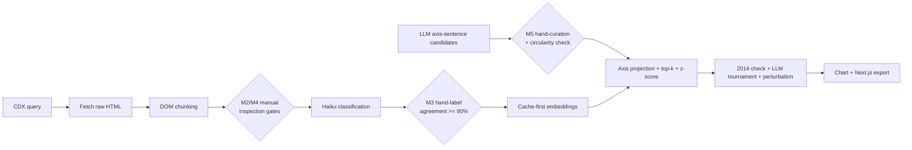

# Careers Page Archaeology — Phase 1 Implementation Plan

## Assessment of [docs/the-language-of-work-plan.md](docs/the-language-of-work-plan.md)

The methodology is sound — contrast-pair axes, a control axis, top-k aggregation, within-company z-scoring, and validation gates are all the right calls. Recommended changes (I'll fold these into the doc):

1. **Embedding determinism caveat.** OpenAI's API is not strictly bit-deterministic across calls. Amend principle 1: determinism comes from a _cache-first design_ — every unique chunk text is embedded exactly once (keyed by text hash + model version) and stored permanently. Re-runs read the cache; nothing is ever re-embedded.
2. **Use Wayback's raw-content flag.** Fetch HTML via `https://web.archive.org/web/{timestamp}id_/{url}` — the `id_` suffix returns the original bytes without the Wayback toolbar/rewriting, which would otherwise pollute extraction.
3. **Dedup via CDX digest.** The CDX API returns a content `digest` per capture; identical captures can be skipped before download. This gives the "mission copy untouched 2016–2019" finding partly for free, complementing the embedding-based near-dup detection in Step 4.
4. **Missing URL patterns.** `www.google.com/about/careers/*` was the canonical careers home for much of 2012–2018 and isn't in the doc's list. Add it as a candidate; the full pattern list gets confirmed by manual archaeology (Manual Step M1).
5. **Pull axis-phrase robustness testing into Phase 1.** Currently it lives only in the risks section. It's cheap (perturb/hold out phrases, confirm year-ranking stability) and validates the methodology before any claims — add to Step 8.
6. **Adaptive top-k.** Thin years may have fewer than k mission chunks; use `k = min(5, n)` and record `n` so coverage flags are honest.
7. **Shared library, not standalone scripts.** The scripts share Wayback client, chunking, embedding cache, and axis math — structure as a small package with thin script entry points.

## Decisions already made

- Embeddings: **OpenAI `text-embedding-3-large`** (pinned, recorded on every row)
- Classifier: **Claude Haiku** (pinned version, temperature 0)
- Frontend: **Next.js included** in this phase, reading static JSON exports
- Storage: raw HTML on disk + parquet/JSONL (no database)

## Repo structure

```
language-of-work/
├── pyproject.toml            # uv-managed; httpx, beautifulsoup4, trafilatura,
│                             # openai, anthropic, pandas, pyarrow, plotly
├── .env.example              # OPENAI_API_KEY, ANTHROPIC_API_KEY
├── src/lowork/
│   ├── wayback.py            # CDX query + rate-limited raw fetcher (id_ URLs)
│   ├── chunking.py           # DOM walker + trafilatura fallback
│   ├── classify.py           # Haiku chunk classifier + agreement scoring
│   ├── embeddings.py         # cache-first embedding store (hash → vector)
│   ├── axes.py               # contrast-pair construction, projection, z-scoring
│   └── io.py                 # parquet/jsonl helpers, manifest handling
├── scripts/                  # thin CLIs: fetch_snapshots, extract_chunks,
│                             # classify_chunks, label_sample, embed_chunks,
│                             # build_axes, score_axes, validate, export_web
├── axes/altruism.yaml        # curated pole sentences (M5) in version control;
│                             # control.yaml; candidates/ holds raw LLM output
├── data/google/
│   ├── snapshots.json        # CDX metadata manifest
│   ├── raw_html/             # {timestamp}_{urlhash}.html — permanent
│   ├── chunks/{year}.jsonl
│   ├── labels/sample.csv     # hand-labeled validation set (M3)
│   ├── embeddings.parquet
│   └── axis_scores.parquet
└── web/                      # Next.js app, reads data exported to web/public/data/
```

## Pipeline



## Build sequence

**Step 0 — Scaffold.** uv project, package skeleton, `.env.example`, `.gitignore`. Raw HTML is the permanent record but bulky — default: keep on disk, gitignored, with the `snapshots.json` manifest committed (revisit LFS if you want it in the repo).

**Step 1 — Fetch** (`fetch_snapshots.py`). CDX query across all URL patterns with `filter=statuscode:200`, `collapse=timestamp:6` (≈monthly), digest dedup; pick 3–4 spread captures/year; download via `id_` URLs at ~1 req/sec with retries; also probe CDX for archived JSON/API endpoints under `careers.google.com/api/*` and `jobs.google.com/api/*` for the SPA era. Writes `snapshots.json` + raw HTML.

**Step 2 — Extract** (`extract_chunks.py`). DOM walker emitting heading+content chunks (50–300 words, merge/split rules), trafilatura comparison column, per-snapshot coverage stats (chunk count, total words) logged into the manifest.

**Step 3 — Classify** (`classify_chunks.py` + `label_sample.py`). Labeling helper emits a random 75–100 chunk CSV for you to fill in (M3); classifier runs Haiku at temperature 0 with the six labels; agreement report against your labels; iterate prompt until ~90%.

**Step 4 — Axis construction** (`generate_axis_candidates.py`, `build_axes.py`). Per the doc's Step 6 descriptor rules: an LLM generates 15–20 candidate sentences per pole in careers-page voice; you hand-curate down to 6–10 (manual gate M5); curated sentences live in `axes/*.yaml`. `build_axes.py` adds an automated **circularity check** — each curated sentence is compared against the corpus chunks (embedding cosine + n-gram overlap) and flagged if it's a near-verbatim lift from the text being measured. Control axis built the same way from the doc's full-sentence examples.

**Step 5 — Embed + score** (`embed_chunks.py`, `score_axes.py`). Cache-first embedding of mission/benefits chunks and axis sentences; signed projections; per-year adaptive top-k mean; within-company z-scores; near-dup detection across adjacent years (cosine > 0.95 → "carried forward").

**Step 6 — Validate** (`validate.py`). (a) 2014 peak check with control-axis flatness; (b) Haiku/Sonnet pairwise tournament across year pairs, randomized order, Bradley-Terry ranking vs embedding ranking; (c) axis-sentence perturbation: leave-one-sentence-out per pole, confirm year-ranking rank correlation (Spearman) stays high. Outputs a validation report markdown.

**Step 7 — Visualize.** Python plotly chart first (the validation deliverable), then `export_web.py` writes JSON to `web/public/data/`, and the Next.js page `/google/altruism`: trend line + control overlay, coverage flags, evidence quotes per year, new-vs-carried-forward indicator.

## Manual steps (your work, built into the sequence)

- **M1 — URL archaeology (before Step 1):** browse web.archive.org for each candidate pattern (`google.com/jobs`, `google.com/intl/*/jobs`, `google.com/about/careers`, `careers.google.com`, `about.google/careers`, `jobs.google.com`) and note active eras + any patterns I missed. I'll generate a checklist with direct Wayback calendar links to make this fast.
- **M2 — Snapshot spot-check (after Step 1):** open ~10 fetched snapshots across eras in the browser (I'll emit a links list) and confirm they're real careers pages, not redirects/error shells.
- **M3 — Hand-label 75–100 chunks (during Step 3):** fill in the label column in `data/google/labels/sample.csv`. This is the classifier's ground truth; budget ~45–60 min.
- **M4 — Mission-chunk read-through (after Step 3):** read mission chunks for ~5 spread years end to end; verdict on extraction quality and whether SPA years need the JSON fallback. Hard gate — nothing downstream runs until you sign off.
- **M5 — Curate axis sentences (Step 4):** review the 15–20 LLM-generated candidate sentences per pole and select 6–10 following the doc's rules (careers-page register, varied surface form, conceptually tight, no verbatim lifts from the corpus — the circularity check flags suspects, you make the call). Budget ~20–30 min per axis; Phase 1 has two (altruism + control).
- **M6 — Validation review (Step 6):** read the validation report, eyeball evidence quotes, adjudicate any embedding-vs-LLM disagreements.
- **M7 — API keys:** put `OPENAI_API_KEY` and `ANTHROPIC_API_KEY` in `.env`.

## Costs (rough)

- Embeddings: a few thousand chunks + axis phrases ≈ well under $1
- Haiku classification: ~$1–3 for the full corpus, pennies per prompt iteration
- Pairwise tournament: ~20 year-pairs × a few chunks ≈ under $1

## Doc updates

I'll also apply the seven recommended changes above to [docs/the-language-of-work-plan.md](docs/the-language-of-work-plan.md) so the plan doc stays the source of truth. Note: the doc's latest revision lost its markdown formatting (headers, bullets, emphasis were stripped — likely a paste from rendered text); I'll restore the formatting while preserving the new Step 6 content when I make those edits.
